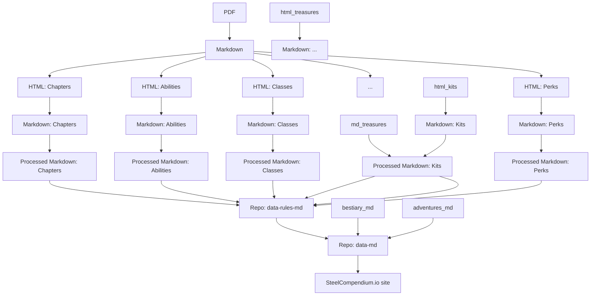

# Draw Steel Compendium

_Draw Steel Compendium is an independent product published under the DRAW STEEL Creator [[LICENSE|License]] and is not affiliated with MCDM Productions, LLC. DRAW STEEL © 2025 MCDM Productions, LLC._

This repo does all the heavy lifting of converting packet docs (in markdown form) into alternate formats.  See the `etl`
directory for the conversion logic.  It's a mess, good luck!

## Data Flow

Please use this [form to report bugs](https://docs.google.com/forms/d/e/1FAIpQLSc6m-pZ0NLt2EArE-Tcxr-XbAPMyhu40ANHJKtyRvvwBd2LSw/viewform?usp=sharing&ouid=105036387964900154878) if you find them!